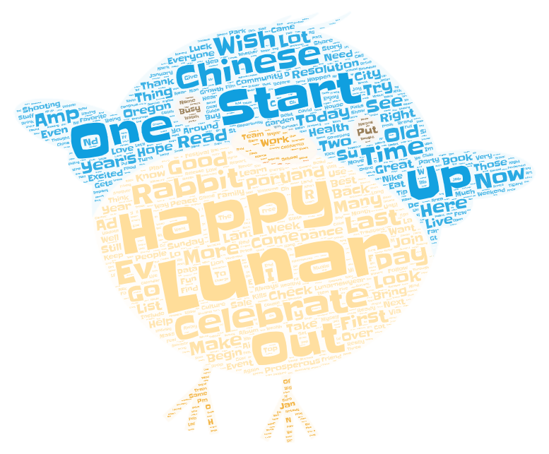
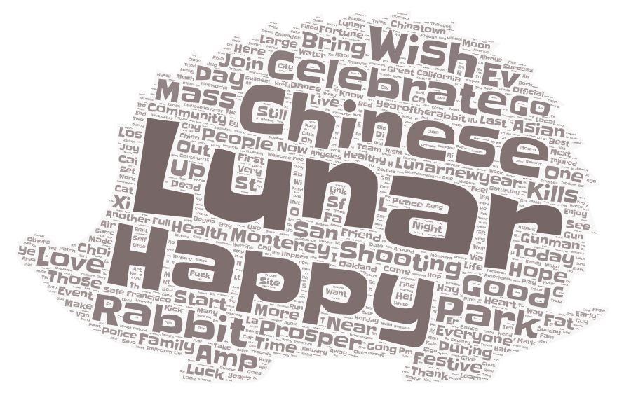

## Topic
My topic is about people's perceptions on New Year. The parameters I used are
<ul>
    <li>Search Term: new year</li>
    <li>Search Radius: 16.48 miles</li>
    <li>Date Since: 01/14/2023</li>
    <li>I also included three study areas: Seattle, Portland, and the bay area</li>
</ul>

## why do I want to make this comparison
People in different regions celebrate the new year differently and it is interesting to see how people from various places celebrate the new year.

## Compare Word Clouds
As shown below, all three word clouds showed similar themes including Chinese new year and lunar new year. The three word clouds are different in terms of what people actually do to celebrate the new year. For example, the first one mentioned dancing, the second mentioned making resolutions, the third one mentioned going to parks.

## Possible reasons for the word cloud patterns 
There are probably a decent amount of Chinese population in all three cities as all three word cloud mentioned the zodiac sign 'rabbit'. However, there definitely exists other populations.

## Future work
The search term 'new year' is still very broad. In the future I can refine the term and look at 'Chinese new year'. I can also refine the study area. Both can be potential improvements.

## Anything that stands out
I didn't expect the word 'rabbit' would show up so often. I also didn't expect that there would be a divide between 'lunar new year' and 'Chinese new year'.

## Data I used
[data1](assets/twsearch_result1.csv)
[data2](assets/twsearch_result2.csv)
[data3](assets/twsearch_result3.csv)
all data crawled from twitter using crawler developed by the Humanistic lab
